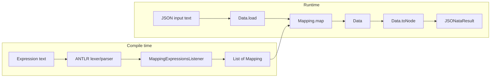

# Architecture — JSONata.java

**Canonical description of system structure.** Agents must read this before structural or cross-cutting work and update it when architecture changes.

Related: [`DOMAIN_LANGUAGE.md`](DOMAIN_LANGUAGE.md) (vocabulary) · [`AGENTS.md`](AGENTS.md) (agent workflows)

---

## Purpose

JSONata.java is a **Java 21 library** that parses and evaluates [JSONata](https://docs.jsonata.org) expressions against JSON input. It is a native implementation built around ANTLR for parsing and Jackson for JSON I/O.

**Public API:**

```java
JSONata jsonata = JSONata.jsonata(expr)
    .bind("name", jsonNode)
    .registerFunction("fn", call -> { ... });
jsonata.evaluate(jsonString);
```

Also: `JSONata.jsonata(expr, EvaluationEnvironment)` for bindings at parse time.

---

## High-Level Flow



1. **Parse** — Expression string → ANTLR parse tree → listener builds `Mapping` objects (compile to evaluators).
2. **Load** — JSON string → `Data` domain model via `JsonFactory`.
3. **Evaluate** — `Mapping.map(original, context)` walks/transforms `Data`; facade converts to `JSONataResult`.

Multi-statement expressions are composed by reducing the mapping list in `JSONata.evaluate`.

---

## Layered Architecture

| Layer | Package(s) | Responsibility |
|-------|------------|----------------|
| **Application** | `dev.vepo.jsonata` | Facade (`JSONata`), public result type (`JSONataResult`) |
| **Domain** | `functions/`, `results/`, `exception/` | Expression semantics, evaluation, result model |
| **Infrastructure** | `parser/`, `functions/json/`, `functions/regex/` | ANTLR pipeline, Jackson adapters, Nashorn regex |

**Dependency rule:** Infrastructure and application depend on domain abstractions. Domain logic lives in `Mapping` implementations and `Data` subtypes — not in the listener beyond assembly.

```
dev.vepo.jsonata/
├── JSONata.java                 # Application facade
├── JSONataResult.java           # Public result contract
├── parser/                      # Infrastructure — parse pipeline
│   ├── MappingExpressionsListener.java   # Parse tree → Mapping
│   ├── BuiltInFunction.java              # Built-in registry
│   └── JSONataValidator.java
├── functions/                   # Domain — evaluation core
│   ├── Mapping.java             # Central evaluator interface
│   ├── MappingParser.java       # Orchestrates ANTLR (infra entry)
│   ├── MappingJoin.java         # Path composition (.)
│   ├── BlockContext.java        # Variables & functions in blocks
│   ├── data/                    # JSON value model during eval
│   ├── builtin/                 # Built-in function implementations
│   ├── json/                    # Jackson adapter (infra)
│   └── regex/                   # Regex engine adapter (infra)
├── results/                     # Domain — JSONataResult implementations
└── exception/
    └── JSONataException.java
```

Grammar source: `src/main/antlr4/.../MappingExpressions.g4` → generated code under `target/generated-sources/antlr4/`.

---

## Core Abstractions

### Mapping

The heart of evaluation. Every expression construct compiles to a `Mapping`:

```java
Data map(Data original, Data current);
```

| Parameter | JSONata equivalent | Role |
|-----------|-------------------|------|
| `original` | `$$` | Root input document |
| `current` | `$` | Context at this evaluation step |

Mappings compose via `andThen`, `MappingJoin` (paths), and nested structures (blocks, functions).

### Data

In-memory JSON value during evaluation. Subtypes: `ObjectData`, `ArrayData`, `GroupedData` (multi-match sequences), `EmptyData`, `RegexData`.

- **Inbound:** `Data.load(String)` → Jackson parse → domain types
- **Outbound:** `Data.toNode()` → `JSONataResult`

### JSONataResult

Caller-facing result (`asText`, `asInt`, `multi()`, etc.). Factory: `JSONataResults` — `empty`, `object`, `array`, `group`.

---

## Parse Pipeline (Infrastructure)

```
String
  → MappingExpressionsLexer
  → MappingExpressionsParser.expressions()
  → ParseTreeWalker + MappingExpressionsListener
  → List<Mapping>
```

The listener is a **compiler**: each grammar rule exit handler pushes/pops `Mapping` instances on a stack. It wires:

- Literals → constant mappings
- Paths → `MappingJoin` + `FieldMap`
- Operators → `AlgebraicOperation`, `CompareValues`, `Coalesce`, `OrderBy`, `Transform`, …
- Path binds → `PositionalBind`, `ContextBind`, `ParentReference`, `PathBindings`
- Calls → `BuiltInFunction.instantiate`, `UserDefinedFunction`, `RegisteredFunction`
- Blocks → `BlockContext` for variables and nested functions

Errors: `JSONataValidator` + `ParseCancellationException` on syntax errors.

---

## Built-in Functions

Registry: `BuiltInFunction` enum → `BuiltInSupplier` → domain `Mapping` in `functions/builtin/`.

To add a built-in:

1. Implement `Mapping` in `functions/builtin/`
2. Register in `BuiltInFunction` enum
3. Add feature tests
4. Update `DOMAIN_LANGUAGE.md` if new vocabulary

Currently registered: **66 built-ins** (string, numeric, boolean, array, object, HOF, date/time, encoding). See `BuiltInFunction` enum for the full list.

Shared helpers: `BuiltInArgs` (optional context args), `FunctionApplicator` (HOF), `PathBindings` (parent / `#` / `@`).

---

## Conformance Testing

Official [jsonata-js test suite](https://github.com/jsonata-js/jsonata/tree/master/test/test-suite) is vendored as a git submodule:

```
src/test/resources/jsonata-js/test/test-suite/
```

Initialize: `git submodule update --init --recursive`

| Component | Location |
|-----------|----------|
| Case runner | `src/test/java/dev/vepo/jsonata/conformance/ConformanceCase.java` |
| JUnit harness | `JsonataConformanceTest` (baseline report; parameterized cases `@Disabled` until pass rate improves) |
| Skip list | `ConformanceSkipList` (`performance`, `token-conversion`, `tail-recursion`) |
| Diagnostics | `ConformanceDiagnostics` — `mvn exec:java` baseline pass rate |

Current baseline: ~46% of cases pass (tracked via `printBaselineReport`).

---

## Embedding API

`EvaluationEnvironment` supports external bindings and registered functions:

```java
var env = EvaluationEnvironment.builder()
    .bind("price", mapper.readTree("{ \"foo\": { \"bar\": 45 } }"))
    .registerFunction("double", call -> ...)
    .build();
JSONata.jsonata("$price.foo.bar", env).evaluate(input);
```

`JSONata.bind()` / `registerFunction()` return new instances with merged environment (immutable-style).

---

## Module & Dependencies

**Module:** `jsonata.java` (`module-info.java`) exports `dev.vepo.jsonata` only.

| Dependency | Role |
|------------|------|
| ANTLR 4 | Lexer/parser generation and runtime |
| Jackson | JSON parsing and node construction |
| Nashorn | Regex evaluation in `RegExp` |
| SLF4J | Logging (listener, `MappingJoin`) |
| Apache Commons Text | String unescape in parser |

**Tests:** JUnit 5, AssertJ, JaCoCo (coverage → SonarCloud).

---

## Build & Quality

```bash
mvn test      # unit tests
mvn verify    # tests + JaCoCo report
mvn test -Dtest=JsonataConformanceTest#printBaselineReport  # conformance baseline
```

CI (`.github/workflows/build.yml`): JDK 17, `mvn verify` + SonarCloud analysis.  
Local target: **Java 21** (`pom.xml` compiler source/target).

---

## Extension Points

| Extension | Mechanism |
|-----------|-----------|
| New expression syntax | Edit `MappingExpressions.g4`, listener handler, domain `Mapping` |
| New built-in | `builtin/` + `BuiltInFunction` enum |
| New value shape | `Data` subtype + `JsonFactory` / `toNode` wiring |
| Public API | `JSONata`, `JSONataResult`, `EvaluationEnvironment` (module exports `dev.vepo.jsonata` only) |

---

## Design Constraints

- **Tell, don't ask** — behavior on `Data` / `Mapping`, not scattered conditionals (see `oop-principles.mdc`).
- **Thin facade** — `JSONata` orchestrates; no evaluation logic in the facade.
- **Generated code** — never edit ANTLR output under `target/`; change `.g4` and rebuild.
- **Domain language** — names and docs follow `DOMAIN_LANGUAGE.md`.

---

## When to Update This Document

Update in the **same change** when you:

- Add/remove a package or shift layer boundaries
- Change the parse → evaluate pipeline or key abstractions
- Add a new extension point or public API entry
- Introduce/remove a major dependency
- Change build, CI, or module exports

Do **not** update for: single-class refactors within an existing package, new built-ins that follow existing patterns, or test-only changes.
